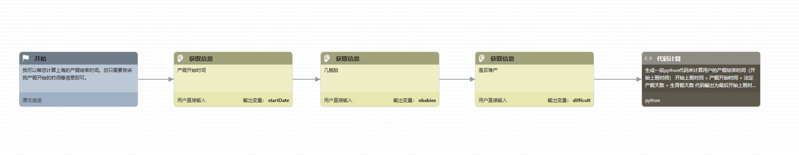

# hr-agent

#### 介绍
HR AI智能体，可以自动计算产假结束日期

#### 煎蛋流程

#### 使用说明

1. 创建任意煎蛋智能体
2. 点击进入智能体编辑界面
3. 点击源代码 -> 导入
4. 选择文件agent.gen，完整流程即可导入。
5. 点击保存、调试按钮，即可开始对话

#### 注册煎蛋账号

1.  访问https://gendial.cn
2.  与右下角的煎蛋对话获取测试账号
